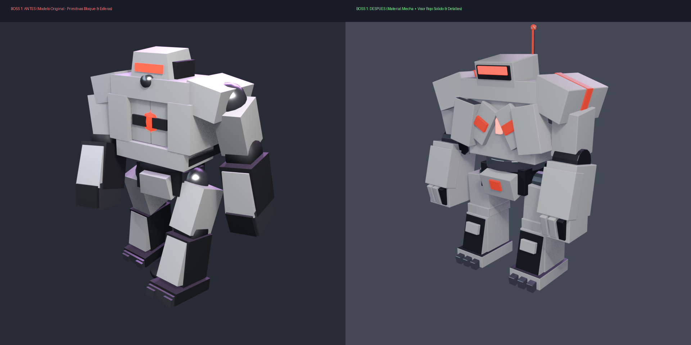
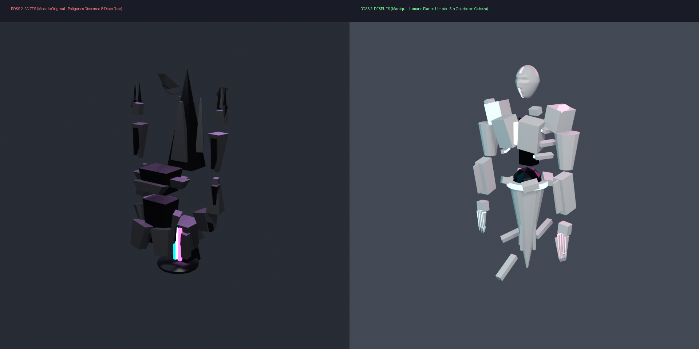
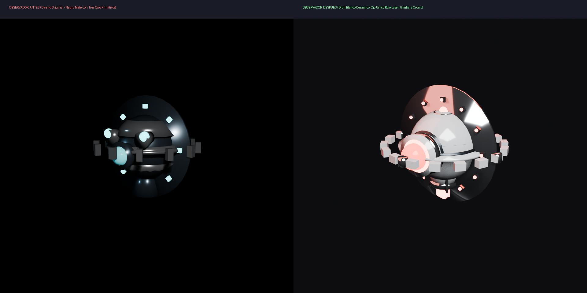
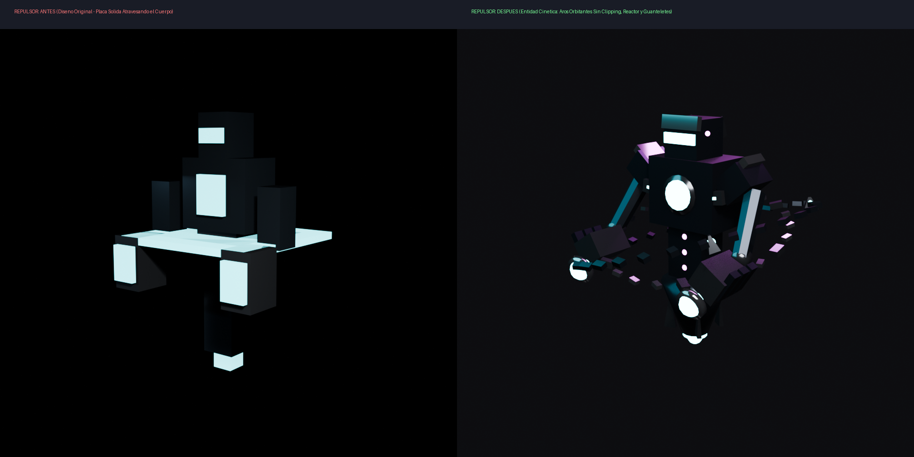
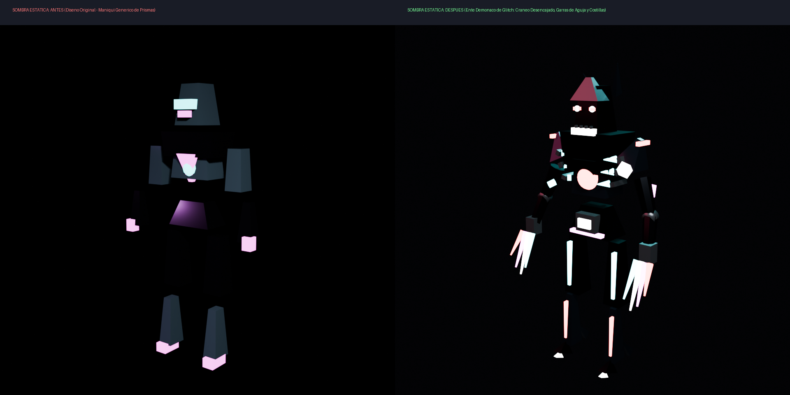

# Asset Orchestration Engine (AOE) 🚀
**Autonomous, Deterministic 3D & Audio Asset Generation, Validation, and Optimization Pipeline**

[](tests/)
[](docs/INDICE-CONOCIMIENTO.md)
[](docs/UE5-PORTABLE-WORKFLOW-GUIDE.md)
[](https://www.python.org/)
[](https://www.blender.org/)
[](LICENSE)

---

## 🧭 Master Documentation & Guides

| Document | Description |
| :--- | :--- |
| 📚 **[docs/INDICE-CONOCIMIENTO.md](docs/INDICE-CONOCIMIENTO.md)** | **Master Knowledge Index** — Complete catalog of all 110+ specs, modules, and 93 acceptance test suites. |
| 🏗️ **[docs/UAF-NEXTGEN-ARCHITECTURE-GUIDE.md](docs/UAF-NEXTGEN-ARCHITECTURE-GUIDE.md)** | **Next-Gen Architecture Guide** — End-to-end integration: Macro-Landscape, WFC Levels, GOAP AI Squads, and UE5 Bundling. |
| 📦 **[docs/UE5-PORTABLE-WORKFLOW-GUIDE.md](docs/UE5-PORTABLE-WORKFLOW-GUIDE.md)** | **UE5 Portable Workflow Guide** — Offline/air-gapped asset bundle generation, headless ingestion, and runtime deployment. |
| 🔮 **[docs/UAF-ROADMAP-PENDIENTES-BACKLOG.md](docs/UAF-ROADMAP-PENDIENTES-BACKLOG.md)** | **Strategic Backlog & Roadmap** — Planned future phases (UAF-81.93 to UAF-81.96: Economy, Audio, LiveLink, Playtesting). |
| 🎮 **[docs/DARX-PRODUCTION-CASE-STUDY.md](docs/DARX-PRODUCTION-CASE-STUDY.md)** | **DarX AAA Production Case Study** — 16 character & boss before-vs-after showcases. |

---

## 🌟 Overview

The **Asset Orchestration Engine (AOE)** is an industrial-grade orchestration system that converts high-level natural language intents or technical specifications into production-ready 3D models, procedural meshes, PBR shaders, and sound effects for game engines (**Unreal Engine 5**, Unity, Godot).

Originally engineered for the AAA action game *DarX*, AOE is completely standalone and decoupled, enabling studio-grade autonomous generative pipelines in any game project or 3D production studio.

```
                  ┌─────────────────────────────────────┐
                  │    NATURAL INTENT / SPECIFICATION   │
                  └──────────────────┬──────────────────┘
                                     │
                                     ▼
                  ┌─────────────────────────────────────┐
                  │      INTENT COMPILER (F51/F71)      │
                  └──────────────────┬──────────────────┘
                                     │
                                     ▼
                  ┌─────────────────────────────────────┐
                  │   STRATEGY OPTIMIZER (F78/F79)      │
                  └──────────────────┬──────────────────┘
                                     │
                                     ▼
                  ┌─────────────────────────────────────┐
                  │   BLENDER MCP EXECUTION RUNTIME     │
                  └──────────────────┬──────────────────┘
                                     │
                                     ▼
                  ┌─────────────────────────────────────┐
                  │    AUTOMATED QA & CRITIC (F75-F77)  │
                  └──────────────────┬──────────────────┘
                                     │
                                     ▼
                  ┌─────────────────────────────────────┐
                  │  DELIVERY & PACKAGING (FBX/PBR/UE5) │
                  └─────────────────────────────────────┘
```

---

## 🎮 Production In Action: DarX Game Showcase (Before vs After)

> **Live Industry Proof**: AOE powers the asset generation and modernization pipeline of **DarX**, a first-person tactical sci-fi action/horror game currently in active development for **Unreal Engine 5 (UE5.5)**.

By leveraging AOE's procedural geometry generators, PBR material compilers, and deterministic zero-clipping spatial solvers, **16 entire character and boss entities** (6 main bosses and 10 combat troops) were transformed from rudimentary prototype whiteboxes into AAA production-ready skeletal meshes in seconds:

| Prototype Whitebox (Before) | AOE Production-Ready Asset (After) |
| :---: | :---: |
| *Crude box/sphere geometry, clipping artifacts, flat uncalibrated shaders* | *Bespoke silhouettes, military graphene/chrome PBR, zero-clipping guarantees* |

### 📸 Highlight Showcase:

#### 🤖 Containment Robot Boss (Boss 1)


#### ⚠️ THE ERROR Quantum Glitch Entity (Boss 2)


#### 👁️ The Observer Aerospace Drone (Troop 6)


#### 💥 The Repulsor Kinetic Enforcer (Troop 8)


#### 👤 The Static Shadow Glitch Demon (Troop 10)


👉 **[Explore Full Case Study & All 16 Before vs After Comparisons](docs/DARX-PRODUCTION-CASE-STUDY.md)**

---

## 🛠️ Key Capabilities

### ⚡ Core AOE Engine (Phases 1 to 80)
1. **Deterministic Intent Compilation**: Translates human/AI descriptions into geometric blueprints (`SemanticMeshSpec`, bounding volumes, socket definitions, and PBR node graphs).
2. **Strategy & Cost Optimizer**: Evaluates polycount, draw calls, synthesis time, memory footprint, and quality risk to select the optimal generation path.
3. **Blender MCP Integration**: Direct bridge with Blender 4.x/5.x via Model Context Protocol (MCP) or background batch runner (`blender -b`).
4. **Automated Visual & Geometric Critic**: Real-time evaluation of manifold integrity, watertightness, UV overlap, vertex density, and aesthetic symmetry.
5. **Self-Correction & Autonomous Recovery**: Automated patch generation for failed booleans, non-manifold edges, or texture baking errors without manual intervention.
6. **Multi-View Previsualization Engine**: Produces 4-quadrant orthogonal and action renders (Front, Back, 3/4 Action, FPS View) before exporting to game engine.

### 🌐 Universal Asset Factory & Next-Gen World Systems (UAF-81.0 to UAF-81.92)
7. **Procedural Level Design & 2D/3D WFC (UAF-81.90)**: Wave Function Collapse with Shannon entropy, topological adjacency, zero-softlock Lock-and-Key graph cycles, Mission DAG compilation, and tension-based AI Pacing Director.
8. **Macro-Landscape & Planetary Geology (UAF-81.91)**: Multi-octave Perlin/Simplex terrain, dual-phase Hydraulic (droplet transport/sedimentation) & Thermal (angle-of-repose talus) erosion, Whittaker biomes, Road/River Bezier splines, PCG foliage rules, and native 16-bit binary (`.r16`) heightmaps for UE5 Landscape.
9. **Multi-Agent NPC Cognitive AI & Squad Tactics (UAF-81.92)**: Goal-Oriented Action Planning (GOAP) with $A^*$ backward/forward state-space search, squad tactical maneuvers (Bounding Overwatch, synchronized Flanking $\ge 60^\circ$, Room Breach & Clear), dual-channel Sensory Perception (Visual raycast & Auditory sound events), and automated UE5 StateTree / BehaviorTree export.
10. **Portable Decoupled UE5 Bundling (UAF-81.89)**: Zero-dependency portable bundle packaging (`asset_manifest.json`, textures, meshes, LODs, Python ingestion script) with headless execution support.

---

## 📁 Repository Structure

```
AssetOrchestrationEngine/
├── src/                         # Core AOE & UAF Engine
│   ├── uaf/                     # Universal Asset Factory (Next-Gen World & AI Pipeline)
│   │   ├── procedural_level/    # UAF-81.90 WFC 2D/3D, Lock-and-Key, Mission DAG, Pacing
│   │   ├── macro_landscape/     # UAF-81.91 Hydraulic/Thermal Erosion, Whittaker, .r16
│   │   ├── multi_agent_npc/     # UAF-81.92 GOAP AI, Squad Tactics, Perception, StateTree
│   │   ├── modular_world/       # Modular kitbash, socket grid & spatial authoring
│   │   ├── natural_ecosystem/   # Biomes, flora, foliage clusters & environmental FX
│   │   ├── character_assembly/  # Skeletal rigs, morph targets, garment layers
│   │   ├── animation_pipeline/  # Locomotion state machines & motion validators
│   │   ├── surface_authoring/   # PBR procedural textures, trim sheets & decal maps
│   │   └── lookdev/             # Studio lighting rigs & material lookdev staging
│   ├── production_orchestration/# F80 Production Pipeline (19-stage orchestrator)
│   ├── cost_performance/       # F79 Multi-objective Cost/Performance Optimizer
│   ├── strategy_learning/      # F78 Historical Strategy Learning & Knowledge Base
│   ├── failure_analysis/       # F77 Semantic Failure Diagnosis & Root Cause
│   ├── autonomous_correction/  # F76 Automated Geometry & Shader Patcher
│   ├── automated_visual_eval/  # F75 PBR & Geometric Quality Scorer
│   ├── intent_compiler/        # F51/F71 Prompt to Mesh Specification Compiler
│   ├── tool_governance/        # F49 ResourceLockManager & ToolGuard
│   ├── blender/                # Blender Python bridge and operators
│   └── unreal/                 # Unreal Engine 5 export & bridge manifests
├── tests/                       # Automated Test Suites (8,600+ Tests)
│   ├── uaf/                     # 93 Universal Asset Factory Acceptance Suites
│   ├── world/                   # Deterministic World & Environment Acceptance Suites
│   └── core/                    # AOE Core F1-F80 Engine Tests
├── docs/                        # Complete Technical Documentation (110+ Specifications)
│   ├── INDICE-CONOCIMIENTO.md   # Master Knowledge Index (Complete navigation guide)
│   ├── UAF-NEXTGEN-ARCHITECTURE-GUIDE.md # Next-Gen Unified Architecture Guide
│   ├── UE5-PORTABLE-WORKFLOW-GUIDE.md   # Portable UE5 Ingestion & Bundling Guide
│   ├── UAF-ROADMAP-PENDIENTES-BACKLOG.md # Strategic Roadmap & Pending Phases
│   └── DARX-PRODUCTION-CASE-STUDY.md    # DarX Production Case Study
├── scripts/                     # Standalone generators, runners & diagnostic tools
├── mcp/                         # Model Context Protocol Server & Addons
├── runner.py                    # Global test runner
├── pyproject.toml               # Python package configuration
└── requirements.txt             # Dependencies
```

---

## 🚀 Quickstart Guide

### 1. Installation

```bash
git clone https://github.com/YourOrg/AssetOrchestrationEngine.git
cd AssetOrchestrationEngine
pip install -r requirements.txt
```

### 2. Run Test Suite

Verify the entire 80-phase engine integrity:
```bash
python runner.py
# or
python -m unittest discover -s tests -p "test_*.py"
```

### 3. Generate a 3D Asset via Python API

```python
from src.production_orchestration import ProductionOrchestrator, ProductionRequest

# Initialize the 19-stage orchestrator
orchestrator = ProductionOrchestrator()

# Dispatch an asset generation request
request = ProductionRequest(
    request_id="REQ_WEAPON_001",
    intent_prompt="Futuristic ceramic white rifle with cyan neon emissive strips and dark carbon accents",
    asset_category="Weapon",
    target_engine="UnrealEngine5",
    max_triangles=25000
)

result = orchestrator.execute_pipeline(request)
print(f"Asset Status: {result.status} (Quality Score: {result.quality_score}/100)")
print(f"Output Model: {result.exported_fbx_path}")
```

### 4. Headless Blender Generation

Execute any asset script directly via Blender:
```bash
blender.exe -b base.blend --python scripts/blender_futuristic_white_weapon.py -- --preview-output render.png
```

### 5. Next-Gen Procedural World & Cognitive AI (UAF-81.90 - UAF-81.92)

Generate complete macro-landscapes, WFC procedural levels, and GOAP cognitive squads:
```python
from src.uaf.macro_landscape import LandscapeGenerator, LandscapeConfig
from src.uaf.procedural_level import ProceduralLevelDirector, LevelDirectorConfig
from src.uaf.multi_agent_npc import SquadCoordinator, SquadTacticType, NPCPerceptionSystem

# 1. Macro-Landscape with Hydraulic Erosion & 16-bit .r16 binary export
land_gen = LandscapeGenerator(LandscapeConfig(seed=42, resolution=505, world_size_meters=2000.0))
land_result = land_gen.generate_full_landscape("outputs/landscapes/volcanic_basin")

# 2. Procedural Dungeon / Level with WFC & Lock-and-Key Mission DAG
level_director = ProceduralLevelDirector(LevelDirectorConfig(seed=42, grid_width=16, grid_height=16))
level_plan = level_director.generate_complete_level("outputs/levels/dungeon_bunker")

# 3. Cognitive Multi-Agent AI Squad with GOAP and Bounding Overwatch
squad = SquadCoordinator(squad_id="SQUAD_ALPHA")
squad.set_tactic(SquadTacticType.BOUNDING_OVERWATCH)
print(f"Landscape .r16: {land_result.heightmap_path} | Level Rooms: {len(level_plan.grid.rooms)}")
```

---

## 🤖 AI Agent Integration (Cursor, Claude, Copilot, Antigravity)

The AOE is designed from the ground up to allow AI coding assistants to produce production-ready 3D models with **single-turn batch commands**, saving up to **80% of context tokens**.

See [docs/AI-AGENT-OPERATIONAL-GUIDE.md](docs/AI-AGENT-OPERATIONAL-GUIDE.md) for full instructions, prompt templates, and execution protocols.

---

## 📄 License

Distributed under the MIT License. See [LICENSE](LICENSE) for details.
