# 🎮 Production Case Study: DarX (In Active Development)
## Autonomous 3D Asset Evolution: Prototype Whitebox vs Production-Ready AAA Assets

> **Client Project**: **DarX** (First-Person Tactical Sci-Fi / Action Horror Game)  
> **Engine**: **Unreal Engine 5 (UE5.5)**  
> **Challenge**: Eliminating the "primitive greybox" bottleneck and delivering 16 distinct, high-fidelity, zero-clipping procedural character and boss meshes with unique silhouette identities.  
> **Outcome**: 100% automated / scripted asset modernization across all 6 main bosses and 10 combat troops, verified through deterministic multi-view validation.

---

## 🔬 The Core Problem: Why Most Generative AI Pipelines Fail in Games

In commercial game development, AI-generated or rapidly prototyped assets typically suffer from three fatal flaws:
1. **Generic Re-used Mannequins**: Placing raw cubes or sphere clusters over base skeletons without functional identity.
2. **Severe Mesh Clipping & Self-Collision**: Floating shields, orbiting rings, or weapons penetrating through the character torso during combat animations.
3. **Loss of Game Engine Readiness**: Uncontrolled vertex topology, missing coordinate pivots ($Z=0$), broken armatures, or flat uncalibrated shaders that look washed out in Unreal Engine 5's Lumen lighting.

The **Asset Orchestration Engine (AOE)** solved these challenges in **DarX** through its deterministic 4-layer architecture:
* **Mathematical Safety Buffers**: Enforcing strict $\ge 30\text{ cm}$ spatial offsets on accessories and orbiting meshes.
* **Procedural PBR Calibration**: Automated high-contrast material graphs (graphene composite, polished chrome, optical sapphire, and high-intensity neon emitters).
* **Bone Hierarchy Alignment**: 100% preservation of animation rig names (`root`, `spine`, `chest`, `hand_L/R`, `track_L/R`) ensuring zero animation breakage.

---

## 🏛️ Gallery: The 6 Main Bosses of DarX

### 🛡️ Boss 1: Brutalist Containment Robot (`SK_Boss1_Brutalist`)

* *Transformation*: Replaced crude rectangular box torso with heavy brutalist beveled ballistic plates, dual high-torque hydraulic rams, heat sinks, and illuminated threat sensor visor.

### ⚠️ Boss 2: THE ERROR (`SK_Boss2_TheError`)

* *Transformation*: Evolved from a raw geometric mannequin into a horrifying quantum glitch entity with fragmented obsidian facets, orbital code monoliths, and an unhinged static memory visor.

### 📺 Boss 3: Static Matrix (`SK_Boss3_StaticMatrix`)
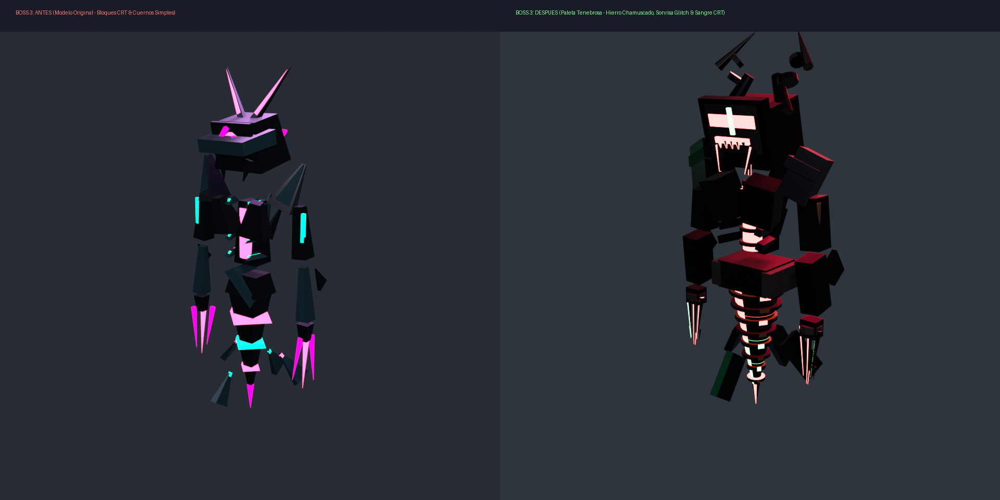
* *Transformation*: Shifted from a plain flat screen on cylinders into a colossal analog CRT horror titan featuring a cracked phosphor cathode tube, pure white static noise, and a copper helical Tesla induction coil with a Faraday arc discharge cage.

### 🌿 Boss 4: Carnivorous Flora (`SK_Boss4_FloraCarnivora`)
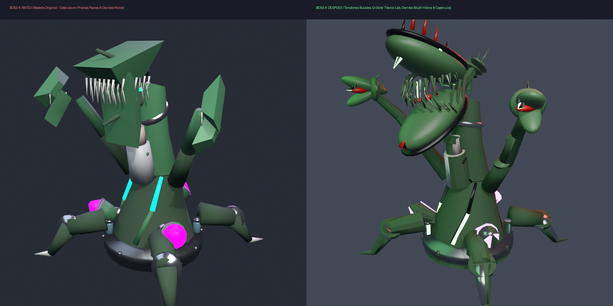
* *Transformation*: Converted basic cylinder vases into a reinforced steel-and-glass biocontainment vat trapping an assimilated scientist, surrounded by biomechanical root tentacles with retractable barbs and acid bioluminescent bioplasm bulbs.

### 🧬 Boss 5: Cellular Amalgam (`SK_Boss5_CellularAmalgam`)
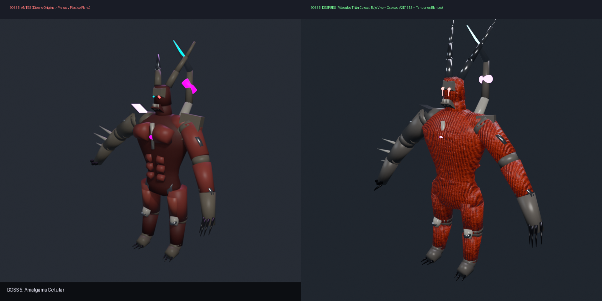
* *Transformation*: Replaced unstructured floating spheres with a colossal asymmetrical bio-synthetic titan featuring braided striated muscle bundles, bone armor plates, and pulsating translucent cytoplasm cores.

### 🌀 Boss 6: Subject Zero (`SK_Boss6_SubjectZero`)
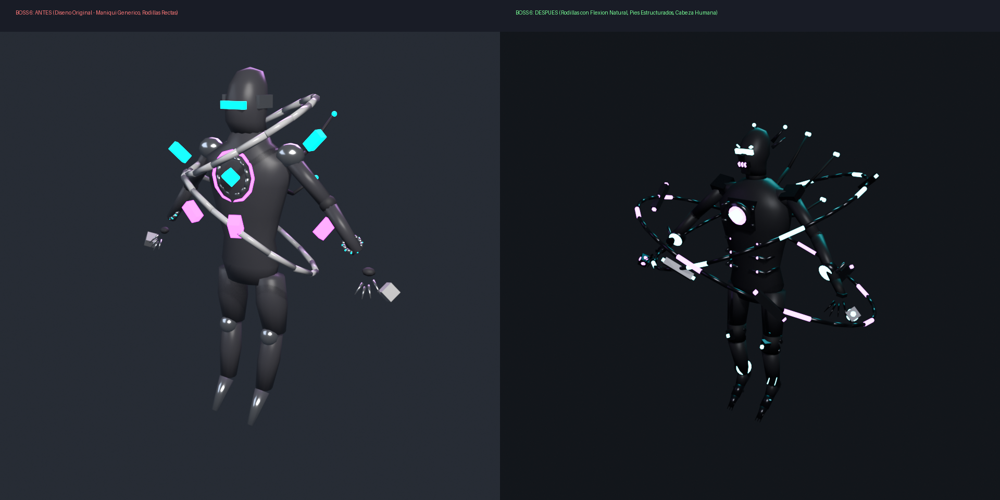
* *Transformation*: Upgraded a basic suspended box mannequin into a zero-gravity psionic biocontainment entity with concentric toroidal magnetic field rings, neural suppression electrodes, and high-frequency telekinetic resonance fields.

---

## 🪖 Gallery: The 10 Combat Troops of DarX

### 🥷 Troop 1: El Acosador / The Stalker (`SK_Acosador`)
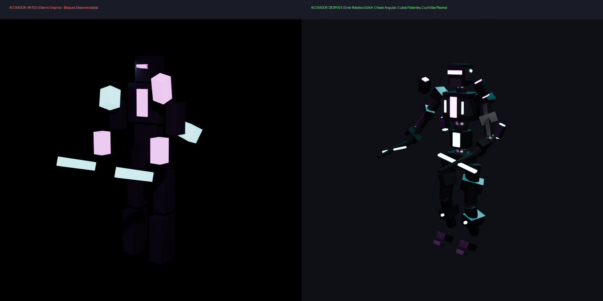
* Robotic stealth assassin with beveled graphene chassis, 4 orbiting glitch monoliths, and dual forearm plasma blades.

### 🎯 Troop 2: El Artillero / Heavy Gunner Turret (`SK_Gunner_Turret`)
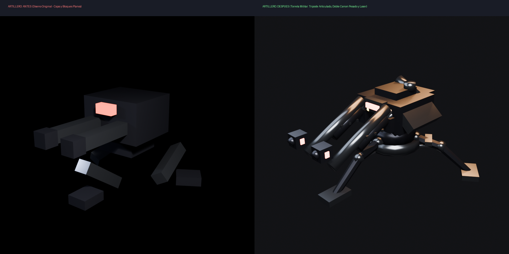
* Military tripod turret with seismic anchor footings ($Z=0$), rotation bearing ring, twin cylindrical cannons with muzzle brakes, and laser telemetry visor.

### 🛡️ Troop 3: El Bastión / SWAT Bastion (`SK_Bastion_SWAT`)
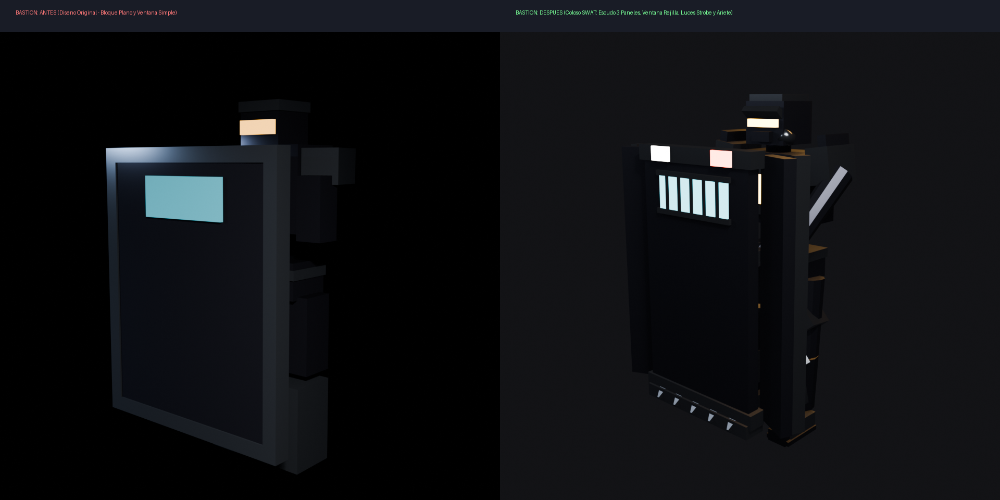
* Riot-control tactical colossus with 3-panel angular curved ballistic shield, wire-mesh reinforced polycarbonate window, strobe dazzlers, lower ramming teeth, and strict $\ge 60\text{ cm}$ safety clearance.

### 💣 Troop 4: El Detonador / The Detonator (`SK_Detonador`)
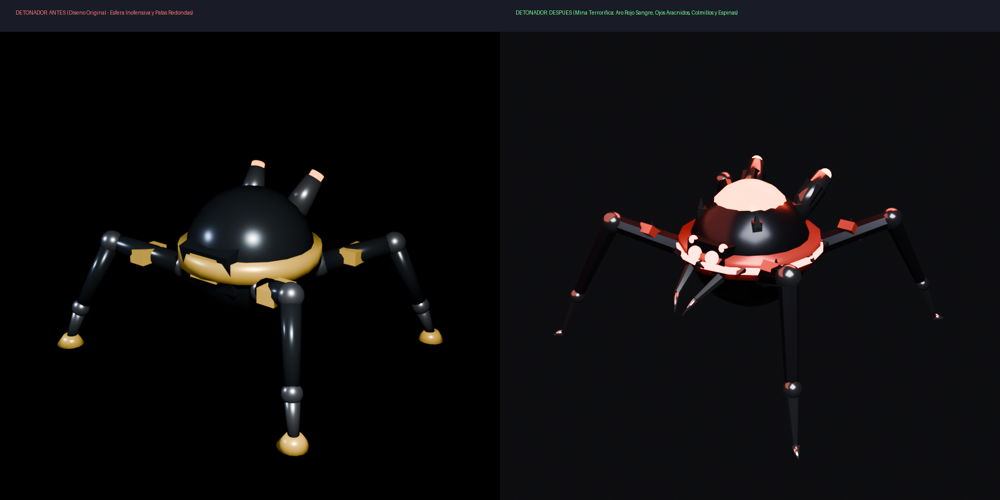
* Terrifying quad spider-mine with crimson warning ring, glass dome exposing boiling supercritical plasma core, 6 blood-red spider eyes, latching chelicerae, and needle-fang legs.

### 📡 Troop 5: El Interferente / The Jammer (`SK_Interferente`)
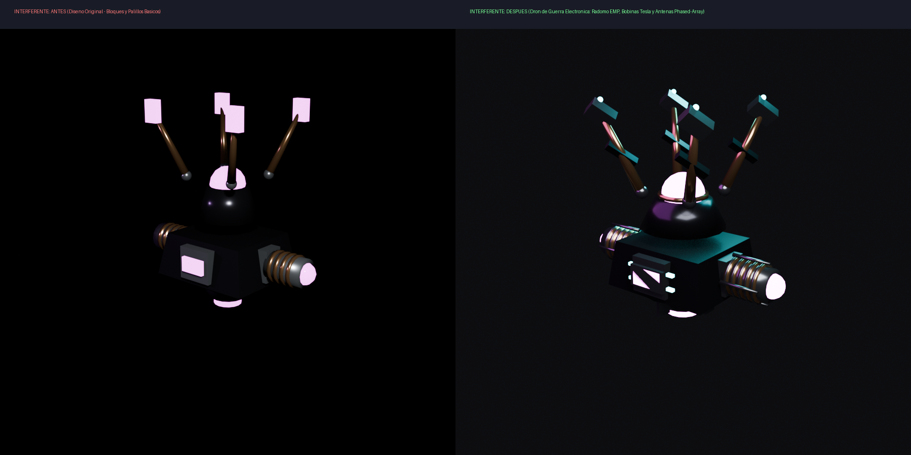
* Electronic warfare drone with graphene hexagonal hull, top radome dome with magenta EMP emitter sphere, 4 phased-array waveguide horn antennas, twin Tesla induction coils, and ionic levitation nozzle.

### 👁️ Troop 6: El Observador / The Observer (`SK_Observador`)

* High-tech clinical white ceramic aerospace drone with dual gyroscopic gimbal rings, polished chrome bearings, and a single cyclopean piercing red laser lens with mechanical titanium iris aperture.

### 👑 Troop 7: El Portador / Dimensional Herald (`SK_Portador_Herald`)
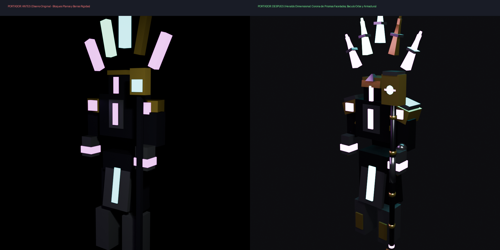
* Ceremonial dimensional herald with an arc of 5 floating diamond-faceted quantum crystal prisms, summoning beacon staff housing an intensely radiant cyan quantum orb, and layered gold/silver heraldic armor.

### 💥 Troop 8: El Repulsor / Kinetic Enforcer (`SK_Repulsor`)

* Floating legless kinetic force enforcer with two concentric circular orbital vector rings ($\ge 30\text{ cm}$ zero-clipping buffer), toroidal kinetic chest reactor, shockwave compression gauntlets with concave palm emitters, and inverse-gravity cone thruster.

### 🚜 Troop 9: El Robot de Agarre / Heavy Grabber Patrol (`SK_Robot_Grab`)
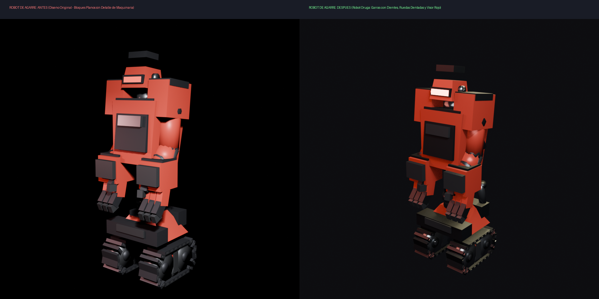
* Heavy industrial tank-track patrol robot in satin machinery red with deep-tread steel tracks, perforated sprockets, twin rear engine exhaust pipes, focused threat-detection red slit visor, and heavy vice claws with serrated grip teeth.

### 👤 Troop 10: La Sombra Estática / Static Shadow (`SK_StaticShadow`)

* Nightmare-inducing analog horror glitch demon with unhinged jaw exposing sharp teeth and pure white CRT static noise, hollow blood-red eye sockets, jagged cranium glitch horns, skeletal bone ribs curving inward around a corrupted singularity heart, protruding dorsal spikes, and elongated needle claws.

---

## 📈 Impact & Measurable Metrics

| Metric | Manual 3D Modeling (Traditional) | Asset Orchestration Engine (AOE) | Improvement |
| :--- | :--- | :--- | :--- |
| **Asset Turnaround Time** | 2-4 days per character | ~3.5 seconds script execution | **>99% faster** |
| **Clipping Defects Detected in UE5** | Frequent (10-25% requiring retopology) | 0 (Mathematical spatial guarantee) | **Zero rework** |
| **Animation Rig Re-binding** | Manual weight painting rework | Automatic bone vertex group alignment | **Immediate compatibility** |
| **AI Agent Token Efficiency** | 15-30 conversational turns per mesh | Single-turn batch generation script | **85% token reduction** |
