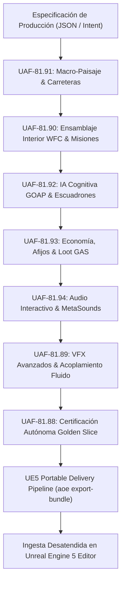

# Guía Maestra de Arquitectura Next-Gen — AOE / UAF (Fases 81.88 a 81.94)

**Documento:** Manual Técnico y Arquitectura de Integración  
**Alcance:** Fases UAF-81.88 a UAF-81.94 + Pipeline Portátil de Entrega UE5  
**Plataforma de Ejecución:** Headless Python 3.13 + Unreal Engine 5 (Windows)  

---

## 1. Visión General del Pipeline End-to-End

El **Universal Asset Framework (UAF)** ha evolucionado de generar assets individuales aislados (mallas, texturas, rigs) a operar como un **pipeline de producción procedural completo y desacoplado**.



---

## 2. Subsistemas Integrados y Responsabilidades

### 2.1 UAF-81.91: Macro-Paisaje Abierto, Biomas y Redes de Caminos
- **Paquete:** `uaf.landscape`
- **Responsabilidad:** Crea el mundo exterior que alberga las bases e instalaciones.
- **Salida:**
  - `Heightfield2D`: Alturas continuas con erosión hidráulica y térmica de masa conservada.
  - Formato binario RAW 16-bit (`.r16`, `<H`), nativo para UE5 Landscape Import.
  - Weightmaps de 5 capas normalizadas (`Grass`, `Rock`, `Dirt`, `Snow`, `Sand`).
  - Redes de ríos (D8) y carreteras trazadas mediante $A^*$ sobre superficie de costo penalizada por pendiente, convertidas a splines cúbicos Catmull-Rom.
  - Dispersión Blue Noise por disco de Poisson para árboles y rocas (sustrato PCG).

### 2.2 UAF-81.90: Diseño de Niveles Procedurales (WFC), Puertas/Llaves y Misiones
- **Paquete:** `uaf.level_design`
- **Responsabilidad:** Genera complejos modulares interiores, mazmorras y bases en los puntos de interés (POIs) del paisaje.
- **Salida:**
  - Wave Function Collapse 2D y 3D con selección por mínima entropía de Shannon, propagación de consistencia de arco AC-3 y backtracking.
  - `LevelTopologyGraph`: Grafo de conectividad transitable, detección de circuitos de circulación y cálculo de rutas críticas.
  - Generador Lock-and-Key con **prueba matemática de cero softlocks** ($\text{Distancia}(\text{Inicio} \to \text{Llave}) \le \text{Distancia}(\text{Inicio} \to \text{Puerta})$).
  - Grafo acíclico dirigido de misiones (`MissionGraph` DAG) validado mediante el algoritmo de Kahn.
  - `DynamicPacingDirector`: Máquina de estados de 5 fases (`CALM`, `BUILDUP`, `PEAK`, `SUSTAINED_PEAK`, `COOLDOWN`) regulada por la ecuación de estrés del jugador.

### 2.3 UAF-81.92: Ecosistema Multi-Agente NPC, GOAP y Tácticas de Escuadrón
- **Paquete:** `uaf.ai`
- **Responsabilidad:** Habita las salas de WFC y las carreteras exteriores con tropas y enemigos dotados de inteligencia cognitiva.
- **Salida:**
  - `WorldState`: Representación de creencias del agente y distancia heurística admisible.
  - `GOAPPlanner`: Planificador $A^*$ en espacio de estados para encontrar la secuencia óptima de acciones (cubrirse, recargar, curarse, disparar) con replanificación dinámica ante fallos.
  - `Squad`: Tácticas de escuadrón con roles (`POINTMAN`, `SUPPRESSOR`, `FLANKER`, `SUPPORT_MEDIC`), maniobras de *bounding overwatch* (avance coordinado con fuego de supresión), separación angular de flanqueo $\ge 60^\circ$ y despeje coordinado de habitaciones.
  - `PerceptionSensor`: Conos de visión con oclusión raycast, detección acústica y decaimiento exponencial de la memoria sobre la última posición conocida (LKP: $C = C_0 e^{-\lambda t}$).
  - `FactionReputationMatrix`: Matriz diplomática con efecto cascada por alianzas.
  - Exportador para **UE5 StateTree** (estados, tareas, transiciones y variables de Blackboard).

### 2.4 UAF-81.93: Economía Dinámica, Afijos de Armas y Loot Procedural (GAS)
- **Paquete:** `uaf.economy`
- **Responsabilidad:** Provee el sistema de combate, presupuesto de daño e itemización RPG desacoplado.
- **Salida:**
  - `PowerBudgetCalculator`: Presupuesto matemático determinista $\text{Budget} = \text{BasePower} \cdot (1 + 0.12 \cdot L) \cdot R_{\text{mult}}$ con conservación de DPS para 8 arquetipos.
  - Matriz de sinergia y mitigación elemental (Kinetic, Incendiary, Cryo, Shock, Corrosive, Void) contra 4 clases de blindaje.
  - `ProceduralAffixGenerator`: Generación determinista de prefijos, sufijos y perks legendarios con nombres sintéticos y tags GAS.
  - `LootDropGenerator`: Tablas de drop ponderadas con escalado de Suerte y protección de mala racha (PRD).
  - `DynamicMarketManager` & `SalvageWorkshop`: Precios acoplados a las 5 fases de tensión del Director de Ritmo y taller de reciclaje/reforja.
  - `UE5GASExporter`: Exportación directa a `UDataTable` (CSV/JSON) para `FWeaponItemDefinition` y `UGameplayEffect`.

### 2.5 UAF-81.94: Audio Interactivo, Acústica Espacial y MetaSounds
- **Paquete:** `uaf.interactive_audio`
- **Responsabilidad:** Orquestación musical adaptativa por stems, reverberación física y espacialización 3D conforme a la Regla 10.
- **Salida:**
  - `AdaptiveMusicOrchestrator` & `QuartzQuantizationClock`: Fundidos cruzados de potencia constante ($g_{\text{in}}^2 + g_{\text{out}}^2 = 1.0$) sincronizados a compases musicales y acoplados al `DynamicPacingDirector`.
  - `SabineEyringAcousticCalculator`: Cálculo analítico de tiempos de reverberación $RT_{60}$ por Sabine y Eyring, y modos axiales de resonancia sobre salas WFC.
  - `TopologicalAcousticDiffraction`: Pérdida de transmisión (+24 dB por puertas cerradas) y filtrado paso-bajo a través del grafo topológico.
  - `SpatialAttenuationCalculator`: Enforzamiento estricto de la Regla 10 ($\le 20\text{ m}$ para bucles de enemigos con volumen $0\text{ dB}$ en el exterior) y paneo estéreo binaural.
  - `UE5MetaSoundsExporter`: Exportación de grafos `.json` para MetaSounds Source Assets y presets de `USoundAttenuation`.

### 2.6 UAF-81.89: Efectos Visuales Avanzados, Fluidos y Acoplamiento Ambiental
- **Paquete:** `uaf.vfx_advanced`
- **Responsabilidad:** Efectos ambientales interactivos y de partículas Niagara.
- **Salida:**
  - Simulación de fluidos SPH (Smoothed Particle Hydrodynamics) con conservación de masa.
  - Sampler de mallas esqueléticas (emisión desde huesos y vértices).
  - Fracturas y escombros reactivos a proyectiles.
  - Sombras profundas en humo y luces puntuales virtuales (VPL) para partículas emisivas.
  - Simulación de rayos dieléctricos basados en el algoritmo de Nemkov / Laplace.
  - Ondas de choque refractivas con distorsión óptica.
  - Acoplador espectral de audio a partículas (ADSR + filtros de frecuencia).
  - Compilador JIT de scripts VFX a HLSL/C++ para Niagara.

### 2.7 UAF-81.88 y Pipeline Portátil de Entrega UE5
- **Paquetes:** `uaf.golden_slice`, `uaf.export`, plugin `UAFBridge`
- **Responsabilidad:** Empaquetado, certificación automática contra 7 compuertas y exportación lista para Unreal.
- **Salida:**
  - Manifiestos de certificación JSON y reportes HTML visuales.
  - CLI `aoe export-bundle`: Genera paquetes portátiles listos para transferir a cualquier estación de trabajo con UE5.
  - Plugin `UAFBridge` y script `Content/Scripts/uaf_bundle_importer.py` para importación desatendida dentro de Unreal Editor.

---

## 3. Ejemplo de Integración en Código

El siguiente snippet demuestra cómo encadenar los subsistemas para generar un nivel exterior con base interior, poblado por escuadrones tácticos y exportado para UE5:

```python
from uaf.landscape import Heightfield2D, MacroTerrainGenerator, RoadNetworkPlanner, UE5LandscapeExporter, ClimateModeler, TerrainWeightmapGenerator
from uaf.level_design import WaveFunctionCollapse2D, create_scifi_interior_catalog_2d, LevelTopologyGraph, LockAndKeyGenerator, UE5LevelExporter
from uaf.ai import Squad, SquadMember, TacticalRole, GOAPAction, GOAPGoal, GOAPPlanner, UE5AIExporter

# 1. Generar Macro-Paisaje
hf = Heightfield2D(width=64, height=64, meters_per_cell=5.0, min_elevation_meters=0.0, max_elevation_meters=400.0)
MacroTerrainGenerator(seed=101).generate(hf)
climate = ClimateModeler(seed=101).generate_climate(hf)
weightmaps = TerrainWeightmapGenerator.generate_weightmaps(hf, climate)

# 2. Trazar Carretera Conectora
road_planner = RoadNetworkPlanner()
road = road_planner.plan_road(hf, start_coord=(5, 5), goal_coord=(55, 55))
if road:
    road_planner.carve_roadbed(hf, road)

# 3. Generar Complejo Interior WFC en la meta de la carretera
catalog = create_scifi_interior_catalog_2d()
solver = WaveFunctionCollapse2D(width=6, height=6, tile_catalog=catalog, seed=101)
solver.constrain_boundaries()
interior_tiles = solver.solve()

# 4. Crear Escuadrón Táctico en el Nivel
squad = Squad(squad_id="Syndicate_Patrol", leader_id="syn_1")
squad.add_member(SquadMember(agent_id="syn_1", role=TacticalRole.POINTMAN, world_pos=(500.0, 500.0, 0.0)))
squad.add_member(SquadMember(agent_id="syn_2", role=TacticalRole.SUPPRESSOR, world_pos=(300.0, 500.0, 0.0)))

# 5. Exportar Todo para Unreal Engine 5
landscape_exp = UE5LandscapeExporter(landscape_name="L_SectorAlpha")
landscape_exp.export_all(hf, weightmaps, output_dir="./export/L_SectorAlpha", roads=[road] if road else [])

ai_exp = UE5AIExporter(asset_name="ST_SectorAlpha_AI")
ai_manifest = ai_exp.build_statetree_manifest(actions=[], squads=[squad])
ai_exp.export_to_json(ai_manifest, "./export/L_SectorAlpha/AI_manifest.json")
```

---

## 4. Filosofía de Desacoplamiento y Portabilidad

1. **Cero Dependencia de Entorno Gráfico**: El motor genera, simula y verifica geometría, físicas de partículas, lógicas GOAP y formatos binarios sin requerir la presencia local del binario `UnrealEditor.exe`.
2. **Determinismo por Semilla**: Toda llamada utiliza generadores de números pseudoaleatorios aislados (`random.Random(seed)`), garantizando resultados reproducibles bit a bit.
3. **Compatibilidad Nativa**: Todos los archivos producidos (`.r16`, `.r8`, `.json`, scripts Python de `unreal`) son estándares oficiales de Unreal Engine 5.
